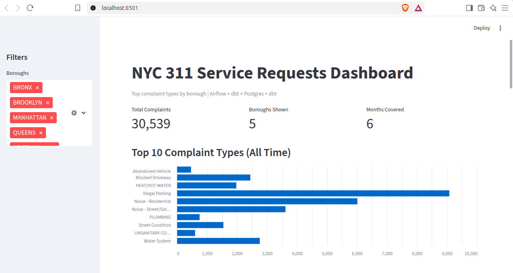
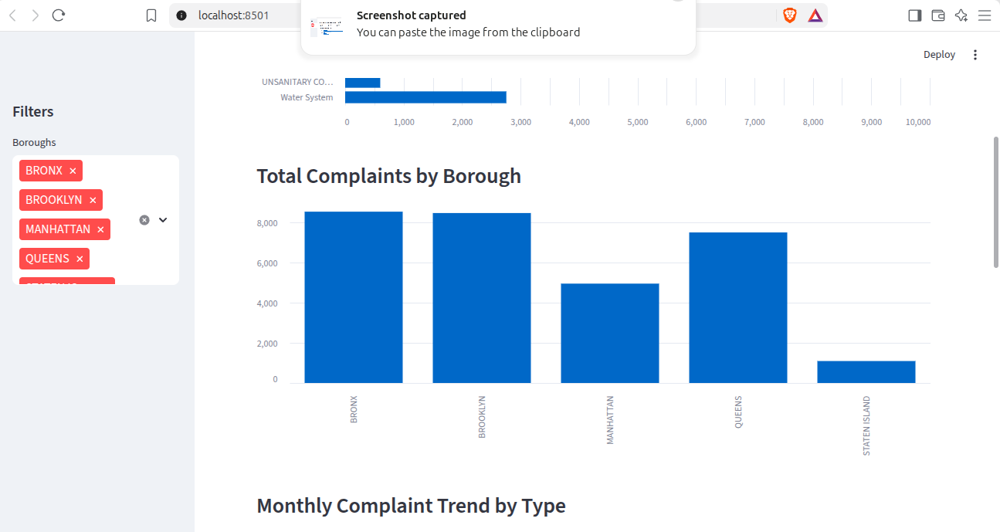
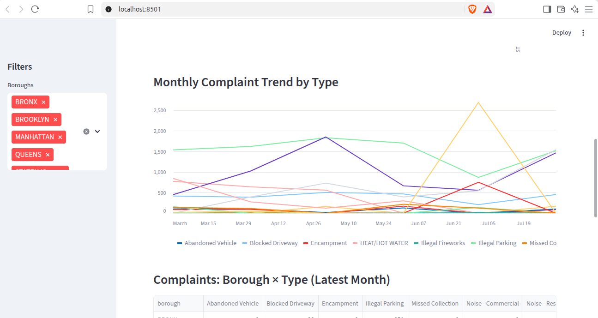
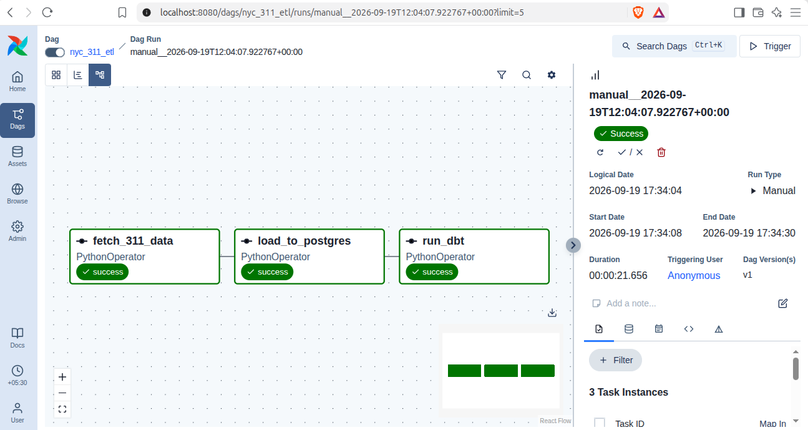
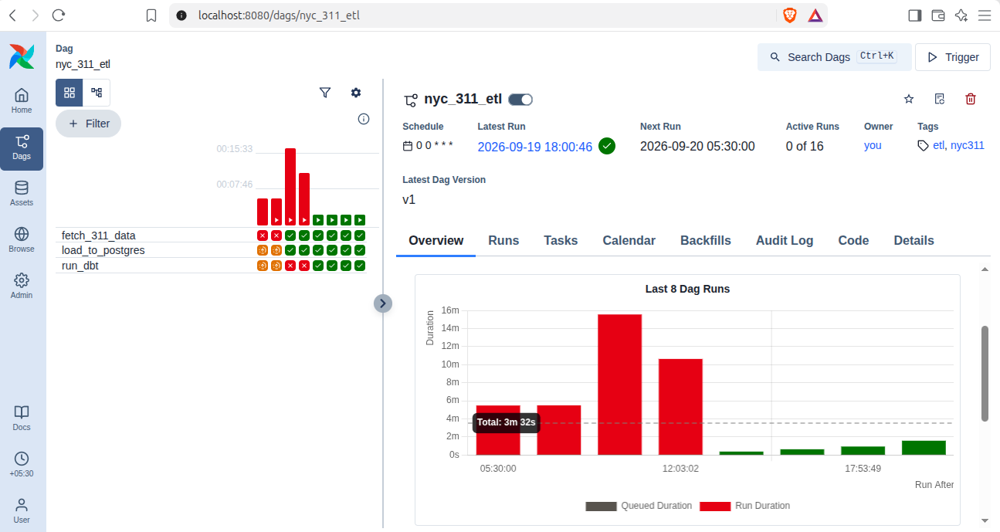

# NYC 311 Complaints Pipeline

> End-to-end data pipeline that ingests NYC 311 service requests from a live REST API, stores them in PostgreSQL, transforms them with dbt, and serves an interactive dashboard via Streamlit.

**🔗 Live Dashboard:** [https://nyc-311-pipeline-qmfskayepvxus5n5kz26s6.streamlit.app/](https://nyc-311-pipeline-qmfskayepvxus5n5kz26s6.streamlit.app/)

|  |  |  |  |  |

---

## Problem

NYC's 311 system handles millions of non-emergency service requests per year (noise complaints, illegal parking, heat issues, etc.). The city publishes this data via a public Socrata API, but there's no simple way to explore trends by borough and complaint type over time.

This project builds a **reproducible, scheduled pipeline** that:
1. Pulls 60K+ rows from the API (3 months of data)
2. Cleans and loads them into PostgreSQL
3. Computes "Top 5 complaint types per borough per month" using dbt
4. Serves the results on an interactive web dashboard

---


**Data flow:**
`API → Airflow (fetch + clean + load) → Postgres (raw) → dbt (staging view → mart table) → Streamlit (visual)`

---

## Tech Stack

| Layer | Technology | Purpose |
|-------|-----------|---------|
| Orchestration | [Airflow 3.x](https://airflow.apache.org/) | Scheduling & task dependency management |
| Database | [PostgreSQL 15](https://www.postgresql.org/) (Docker) | Persistent storage |
| Transformation | [dbt 1.12](https://docs.getdbt.com/) | Modular, testable SQL models |
| Ingestion | Python `requests` + `pandas` | API calls & data cleaning |
| Visualization | [Streamlit](https://streamlit.io/) | Interactive web dashboard |
| Infrastructure | [Docker Compose](https://docs.docker.com/compose/) | Reproducible local environment |

---

## Project Structure
   nyc-311-pipeline/
├── airflow/
│ └── dags/
│ └── nyc_311_dag.py # 3-task DAG: fetch → load → transform
├── dbt_project/
│ ├── dbt_project.yml # dbt project config
│ ├── profiles.yml # DB connection config
│ └── models/
│ ├── sources.yml # Points to raw_311_requests table
│ ├── staging/
│ │ └── stg_311_requests.sql # View: cleaned + derived cols
│ └── marts/
│ └── top_complaints_by_borough.sql # Table: top 5 per boro/month
├── streamlit_app/
│ ├── app.py # Dashboard (KPIs, charts, filters)
│ ├── data.csv # Exported data (for Streamlit Cloud)
│ └── requirements.txt
├── docker-compose.yml # Postgres container
├── requirements.txt # Python dependencies
├── .gitignore
└── README.md


---

## Setup

### Prerequisites

- Python 3.10+
- [Docker Desktop](https://www.docker.com/products/docker-desktop/)
- ~2 GB free disk space

### 1. Clone & Install

```bash
git clone https://github.com/Naivebayes-clas/nyc-311-pipeline.git
cd nyc-311-pipeline

python3 -m venv venv
source venv/bin/activate
pip install -r requirements.txt   


2. Start PostgreSQL
docker compose up -d   

3. Configure & Start Airflow
export AIRFLOW__CORE__DAGS_FOLDER=$(pwd)/airflow/dags
export AIRFLOW__DATABASE__SQL_ALCHEMY_CONN=sqlite:////tmp/airflow.db
export AIRFLOW__CORE__EXECUTOR=SequentialExecutor
export AIRFLOW__CORE__LOAD_EXAMPLES=False

airflow db migrate
airflow standalone   

Open http://localhost:8080 → login with admin / admin.

4. Add Airflow Connection
In the Airflow UI → Admin → Connections → +:

5. Trigger the DAG

6. Start the Dashboard
cd streamlit_app
streamlit run app.py   

Open http://localhost:8501.

How It Works
Task 1: fetch_311_data
Makes 3 sequential API calls (one per month, 20K rows each) to the NYC 311 Socrata API. Writes combined results to a temp CSV.

Task 2: load_to_postgres
Reads the CSV, cleans it (parse dates, strip/uppercase strings, drop nulls), and bulk-inserts into the raw_311_requests table using ON CONFLICT DO NOTHING for idempotency.

Task 3: run_dbt
Executes dbt build which:

Creates a staging view (stg_311_requests) — adds request_month column, filters invalid boroughs
Creates a mart table (top_complaints_by_borough) — uses RANK() window function to keep only the top 5 complaint types per borough per month
Dashboard
Streamlit app connects to the dbt-generated table and renders:

KPIs: total complaints, boroughs shown, months covered
Horizontal bar: Top 10 complaint types (all time)
Bar chart: Total complaints by borough
Line chart: Monthly trend by complaint type
Table: Borough × Type matrix for the latest month


What I Learned
- API ingestion — handling date-filtered queries, pagination via multiple calls, and error handling
- Airflow 3.x — DAG design, task dependencies, connection management, and the standalone deployment mode
- dbt modeling — the staging → marts pattern, views vs. tables, window functions for ranking
- PostgreSQL via Docker — containerized databases, volume persistence, port mapping
- Streamlit deployment — the difference between local (DB connection) and cloud (CSV) data loading
- Idempotent ETL — TRUNCATE + INSERT ... ON CONFLICT DO NOTHING for safe re-runs
